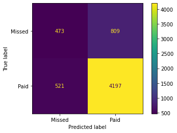
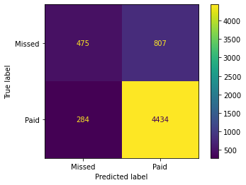
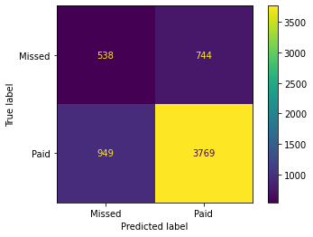
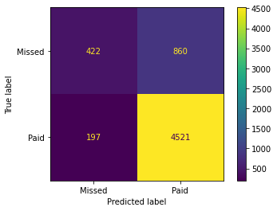
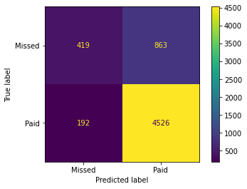

## credit card default prediction
### This repo is about predicting which user will cause credit card default based on their behavior using KNN, Decision tree, and Neural network


```python
import sklearn
import sklearn.model_selection
import sklearn.metrics
import pandas
df=pandas.read_csv("creditCardDefaultReduced.csv")
```


```python
import numpy
numpy.random.seed( 30 )
```


```python
df
```


<div>
<style scoped>
    .dataframe tbody tr th:only-of-type {
        vertical-align: middle;
    }

    .dataframe tbody tr th {
        vertical-align: top;
    }

    .dataframe thead th {
        text-align: right;
    }
</style>
<table border="1" class="dataframe">
  <thead>
    <tr style="text-align: right;">
      <th></th>
      <th>Limit_Bal</th>
      <th>Education</th>
      <th>Marriage</th>
      <th>Age</th>
      <th>Pay_0</th>
      <th>Bill_Amt1</th>
      <th>Pay_Amt1</th>
      <th>Payment</th>
      <th>Card</th>
    </tr>
  </thead>
  <tbody>
    <tr>
      <th>0</th>
      <td>20000</td>
      <td>University</td>
      <td>married</td>
      <td>24</td>
      <td>Delay2</td>
      <td>3913</td>
      <td>0</td>
      <td>Missed</td>
      <td>Normal</td>
    </tr>
    <tr>
      <th>1</th>
      <td>120000</td>
      <td>University</td>
      <td>single</td>
      <td>26</td>
      <td>ontime</td>
      <td>2682</td>
      <td>0</td>
      <td>Missed</td>
      <td>Normal</td>
    </tr>
    <tr>
      <th>2</th>
      <td>90000</td>
      <td>University</td>
      <td>single</td>
      <td>34</td>
      <td>Delay0</td>
      <td>29239</td>
      <td>1518</td>
      <td>Paid</td>
      <td>Normal</td>
    </tr>
    <tr>
      <th>3</th>
      <td>50000</td>
      <td>University</td>
      <td>married</td>
      <td>37</td>
      <td>Delay0</td>
      <td>46990</td>
      <td>2000</td>
      <td>Paid</td>
      <td>Normal</td>
    </tr>
    <tr>
      <th>4</th>
      <td>50000</td>
      <td>University</td>
      <td>married</td>
      <td>57</td>
      <td>ontime</td>
      <td>8617</td>
      <td>2000</td>
      <td>Paid</td>
      <td>Gold</td>
    </tr>
    <tr>
      <th>...</th>
      <td>...</td>
      <td>...</td>
      <td>...</td>
      <td>...</td>
      <td>...</td>
      <td>...</td>
      <td>...</td>
      <td>...</td>
      <td>...</td>
    </tr>
    <tr>
      <th>29995</th>
      <td>220000</td>
      <td>High school</td>
      <td>married</td>
      <td>39</td>
      <td>Delay0</td>
      <td>188948</td>
      <td>8500</td>
      <td>Paid</td>
      <td>Gold</td>
    </tr>
    <tr>
      <th>29996</th>
      <td>150000</td>
      <td>High school</td>
      <td>single</td>
      <td>43</td>
      <td>ontime</td>
      <td>1683</td>
      <td>1837</td>
      <td>Paid</td>
      <td>Gold</td>
    </tr>
    <tr>
      <th>29997</th>
      <td>30000</td>
      <td>University</td>
      <td>single</td>
      <td>37</td>
      <td>Delay4</td>
      <td>3565</td>
      <td>0</td>
      <td>Missed</td>
      <td>Gold</td>
    </tr>
    <tr>
      <th>29998</th>
      <td>80000</td>
      <td>High school</td>
      <td>married</td>
      <td>41</td>
      <td>Delay1</td>
      <td>-1645</td>
      <td>85900</td>
      <td>Missed</td>
      <td>Gold</td>
    </tr>
    <tr>
      <th>29999</th>
      <td>50000</td>
      <td>University</td>
      <td>married</td>
      <td>46</td>
      <td>Delay0</td>
      <td>47929</td>
      <td>2078</td>
      <td>Missed</td>
      <td>Gold</td>
    </tr>
  </tbody>
</table>
<p>30000 rows × 9 columns</p>
</div>


```python
df.dtypes
```


    Limit_Bal     int64
    Education    object
    Marriage     object
    Age           int64
    Pay_0        object
    Bill_Amt1     int64
    Pay_Amt1      int64
    Payment      object
    Card         object
    dtype: object


```python
# summary stats
df.describe()
```


<div>
<style scoped>
    .dataframe tbody tr th:only-of-type {
        vertical-align: middle;
    }

    .dataframe tbody tr th {
        vertical-align: top;
    }

    .dataframe thead th {
        text-align: right;
    }
</style>
<table border="1" class="dataframe">
  <thead>
    <tr style="text-align: right;">
      <th></th>
      <th>Limit_Bal</th>
      <th>Age</th>
      <th>Bill_Amt1</th>
      <th>Pay_Amt1</th>
    </tr>
  </thead>
  <tbody>
    <tr>
      <th>count</th>
      <td>30000.000000</td>
      <td>30000.000000</td>
      <td>30000.000000</td>
      <td>30000.000000</td>
    </tr>
    <tr>
      <th>mean</th>
      <td>167484.322667</td>
      <td>35.485500</td>
      <td>51223.330900</td>
      <td>5663.580500</td>
    </tr>
    <tr>
      <th>std</th>
      <td>129747.661567</td>
      <td>9.217904</td>
      <td>73635.860576</td>
      <td>16563.280354</td>
    </tr>
    <tr>
      <th>min</th>
      <td>10000.000000</td>
      <td>21.000000</td>
      <td>-165580.000000</td>
      <td>0.000000</td>
    </tr>
    <tr>
      <th>25%</th>
      <td>50000.000000</td>
      <td>28.000000</td>
      <td>3558.750000</td>
      <td>1000.000000</td>
    </tr>
    <tr>
      <th>50%</th>
      <td>140000.000000</td>
      <td>34.000000</td>
      <td>22381.500000</td>
      <td>2100.000000</td>
    </tr>
    <tr>
      <th>75%</th>
      <td>240000.000000</td>
      <td>41.000000</td>
      <td>67091.000000</td>
      <td>5006.000000</td>
    </tr>
    <tr>
      <th>max</th>
      <td>1000000.000000</td>
      <td>79.000000</td>
      <td>964511.000000</td>
      <td>873552.000000</td>
    </tr>
  </tbody>
</table>
</div>


```python
# run a classification model on "Payment" - to predict who is likely to default on a loan
outcome = df['Payment']
```


```python
#normalize predictors
numericFeatures = df[ [ 'Limit_Bal', 'Bill_Amt1', 'Pay_Amt1', 'Age' ]] 
numericFeatures = numericFeatures / numpy.linalg.norm(numericFeatures, axis=0)
numericFeatures
```


<div>
<style scoped>
    .dataframe tbody tr th:only-of-type {
        vertical-align: middle;
    }

    .dataframe tbody tr th {
        vertical-align: top;
    }

    .dataframe thead th {
        text-align: right;
    }
</style>
<table border="1" class="dataframe">
  <thead>
    <tr style="text-align: right;">
      <th></th>
      <th>Limit_Bal</th>
      <th>Bill_Amt1</th>
      <th>Pay_Amt1</th>
      <th>Age</th>
    </tr>
  </thead>
  <tbody>
    <tr>
      <th>0</th>
      <td>0.000545</td>
      <td>0.000252</td>
      <td>0.000000</td>
      <td>0.003779</td>
    </tr>
    <tr>
      <th>1</th>
      <td>0.003270</td>
      <td>0.000173</td>
      <td>0.000000</td>
      <td>0.004094</td>
    </tr>
    <tr>
      <th>2</th>
      <td>0.002453</td>
      <td>0.001882</td>
      <td>0.000501</td>
      <td>0.005354</td>
    </tr>
    <tr>
      <th>3</th>
      <td>0.001363</td>
      <td>0.003025</td>
      <td>0.000660</td>
      <td>0.005827</td>
    </tr>
    <tr>
      <th>4</th>
      <td>0.001363</td>
      <td>0.000555</td>
      <td>0.000660</td>
      <td>0.008976</td>
    </tr>
    <tr>
      <th>...</th>
      <td>...</td>
      <td>...</td>
      <td>...</td>
      <td>...</td>
    </tr>
    <tr>
      <th>29995</th>
      <td>0.005995</td>
      <td>0.012162</td>
      <td>0.002804</td>
      <td>0.006141</td>
    </tr>
    <tr>
      <th>29996</th>
      <td>0.004088</td>
      <td>0.000108</td>
      <td>0.000606</td>
      <td>0.006771</td>
    </tr>
    <tr>
      <th>29997</th>
      <td>0.000818</td>
      <td>0.000229</td>
      <td>0.000000</td>
      <td>0.005827</td>
    </tr>
    <tr>
      <th>29998</th>
      <td>0.002180</td>
      <td>-0.000106</td>
      <td>0.028332</td>
      <td>0.006456</td>
    </tr>
    <tr>
      <th>29999</th>
      <td>0.001363</td>
      <td>0.003085</td>
      <td>0.000685</td>
      <td>0.007244</td>
    </tr>
  </tbody>
</table>
<p>30000 rows × 4 columns</p>
</div>


```python
# Dummy variable 
dummiesPay_0 = pandas.get_dummies( df['Pay_0'], prefix="Pay_0", drop_first=True)
```


```python
dummiesPay_0
```


<div>
<style scoped>
    .dataframe tbody tr th:only-of-type {
        vertical-align: middle;
    }

    .dataframe tbody tr th {
        vertical-align: top;
    }

    .dataframe thead th {
        text-align: right;
    }
</style>
<table border="1" class="dataframe">
  <thead>
    <tr style="text-align: right;">
      <th></th>
      <th>Pay_0_Delay1</th>
      <th>Pay_0_Delay2</th>
      <th>Pay_0_Delay3</th>
      <th>Pay_0_Delay4</th>
      <th>Pay_0_Delay5</th>
      <th>Pay_0_Delay6</th>
      <th>Pay_0_Delay7</th>
      <th>Pay_0_Delay8+</th>
      <th>Pay_0_ontime</th>
      <th>Pay_0_unknown</th>
    </tr>
  </thead>
  <tbody>
    <tr>
      <th>0</th>
      <td>0</td>
      <td>1</td>
      <td>0</td>
      <td>0</td>
      <td>0</td>
      <td>0</td>
      <td>0</td>
      <td>0</td>
      <td>0</td>
      <td>0</td>
    </tr>
    <tr>
      <th>1</th>
      <td>0</td>
      <td>0</td>
      <td>0</td>
      <td>0</td>
      <td>0</td>
      <td>0</td>
      <td>0</td>
      <td>0</td>
      <td>1</td>
      <td>0</td>
    </tr>
    <tr>
      <th>2</th>
      <td>0</td>
      <td>0</td>
      <td>0</td>
      <td>0</td>
      <td>0</td>
      <td>0</td>
      <td>0</td>
      <td>0</td>
      <td>0</td>
      <td>0</td>
    </tr>
    <tr>
      <th>3</th>
      <td>0</td>
      <td>0</td>
      <td>0</td>
      <td>0</td>
      <td>0</td>
      <td>0</td>
      <td>0</td>
      <td>0</td>
      <td>0</td>
      <td>0</td>
    </tr>
    <tr>
      <th>4</th>
      <td>0</td>
      <td>0</td>
      <td>0</td>
      <td>0</td>
      <td>0</td>
      <td>0</td>
      <td>0</td>
      <td>0</td>
      <td>1</td>
      <td>0</td>
    </tr>
    <tr>
      <th>...</th>
      <td>...</td>
      <td>...</td>
      <td>...</td>
      <td>...</td>
      <td>...</td>
      <td>...</td>
      <td>...</td>
      <td>...</td>
      <td>...</td>
      <td>...</td>
    </tr>
    <tr>
      <th>29995</th>
      <td>0</td>
      <td>0</td>
      <td>0</td>
      <td>0</td>
      <td>0</td>
      <td>0</td>
      <td>0</td>
      <td>0</td>
      <td>0</td>
      <td>0</td>
    </tr>
    <tr>
      <th>29996</th>
      <td>0</td>
      <td>0</td>
      <td>0</td>
      <td>0</td>
      <td>0</td>
      <td>0</td>
      <td>0</td>
      <td>0</td>
      <td>1</td>
      <td>0</td>
    </tr>
    <tr>
      <th>29997</th>
      <td>0</td>
      <td>0</td>
      <td>0</td>
      <td>1</td>
      <td>0</td>
      <td>0</td>
      <td>0</td>
      <td>0</td>
      <td>0</td>
      <td>0</td>
    </tr>
    <tr>
      <th>29998</th>
      <td>1</td>
      <td>0</td>
      <td>0</td>
      <td>0</td>
      <td>0</td>
      <td>0</td>
      <td>0</td>
      <td>0</td>
      <td>0</td>
      <td>0</td>
    </tr>
    <tr>
      <th>29999</th>
      <td>0</td>
      <td>0</td>
      <td>0</td>
      <td>0</td>
      <td>0</td>
      <td>0</td>
      <td>0</td>
      <td>0</td>
      <td>0</td>
      <td>0</td>
    </tr>
  </tbody>
</table>
<p>30000 rows × 10 columns</p>
</div>


```python
# combine dataframes
features = pandas.concat( [ numericFeatures, dummiesPay_0], axis=1 )
features
```


<div>
<style scoped>
    .dataframe tbody tr th:only-of-type {
        vertical-align: middle;
    }

    .dataframe tbody tr th {
        vertical-align: top;
    }

    .dataframe thead th {
        text-align: right;
    }
</style>
<table border="1" class="dataframe">
  <thead>
    <tr style="text-align: right;">
      <th></th>
      <th>Limit_Bal</th>
      <th>Bill_Amt1</th>
      <th>Pay_Amt1</th>
      <th>Age</th>
      <th>Pay_0_Delay1</th>
      <th>Pay_0_Delay2</th>
      <th>Pay_0_Delay3</th>
      <th>Pay_0_Delay4</th>
      <th>Pay_0_Delay5</th>
      <th>Pay_0_Delay6</th>
      <th>Pay_0_Delay7</th>
      <th>Pay_0_Delay8+</th>
      <th>Pay_0_ontime</th>
      <th>Pay_0_unknown</th>
    </tr>
  </thead>
  <tbody>
    <tr>
      <th>0</th>
      <td>0.000545</td>
      <td>0.000252</td>
      <td>0.000000</td>
      <td>0.003779</td>
      <td>0</td>
      <td>1</td>
      <td>0</td>
      <td>0</td>
      <td>0</td>
      <td>0</td>
      <td>0</td>
      <td>0</td>
      <td>0</td>
      <td>0</td>
    </tr>
    <tr>
      <th>1</th>
      <td>0.003270</td>
      <td>0.000173</td>
      <td>0.000000</td>
      <td>0.004094</td>
      <td>0</td>
      <td>0</td>
      <td>0</td>
      <td>0</td>
      <td>0</td>
      <td>0</td>
      <td>0</td>
      <td>0</td>
      <td>1</td>
      <td>0</td>
    </tr>
    <tr>
      <th>2</th>
      <td>0.002453</td>
      <td>0.001882</td>
      <td>0.000501</td>
      <td>0.005354</td>
      <td>0</td>
      <td>0</td>
      <td>0</td>
      <td>0</td>
      <td>0</td>
      <td>0</td>
      <td>0</td>
      <td>0</td>
      <td>0</td>
      <td>0</td>
    </tr>
    <tr>
      <th>3</th>
      <td>0.001363</td>
      <td>0.003025</td>
      <td>0.000660</td>
      <td>0.005827</td>
      <td>0</td>
      <td>0</td>
      <td>0</td>
      <td>0</td>
      <td>0</td>
      <td>0</td>
      <td>0</td>
      <td>0</td>
      <td>0</td>
      <td>0</td>
    </tr>
    <tr>
      <th>4</th>
      <td>0.001363</td>
      <td>0.000555</td>
      <td>0.000660</td>
      <td>0.008976</td>
      <td>0</td>
      <td>0</td>
      <td>0</td>
      <td>0</td>
      <td>0</td>
      <td>0</td>
      <td>0</td>
      <td>0</td>
      <td>1</td>
      <td>0</td>
    </tr>
    <tr>
      <th>...</th>
      <td>...</td>
      <td>...</td>
      <td>...</td>
      <td>...</td>
      <td>...</td>
      <td>...</td>
      <td>...</td>
      <td>...</td>
      <td>...</td>
      <td>...</td>
      <td>...</td>
      <td>...</td>
      <td>...</td>
      <td>...</td>
    </tr>
    <tr>
      <th>29995</th>
      <td>0.005995</td>
      <td>0.012162</td>
      <td>0.002804</td>
      <td>0.006141</td>
      <td>0</td>
      <td>0</td>
      <td>0</td>
      <td>0</td>
      <td>0</td>
      <td>0</td>
      <td>0</td>
      <td>0</td>
      <td>0</td>
      <td>0</td>
    </tr>
    <tr>
      <th>29996</th>
      <td>0.004088</td>
      <td>0.000108</td>
      <td>0.000606</td>
      <td>0.006771</td>
      <td>0</td>
      <td>0</td>
      <td>0</td>
      <td>0</td>
      <td>0</td>
      <td>0</td>
      <td>0</td>
      <td>0</td>
      <td>1</td>
      <td>0</td>
    </tr>
    <tr>
      <th>29997</th>
      <td>0.000818</td>
      <td>0.000229</td>
      <td>0.000000</td>
      <td>0.005827</td>
      <td>0</td>
      <td>0</td>
      <td>0</td>
      <td>1</td>
      <td>0</td>
      <td>0</td>
      <td>0</td>
      <td>0</td>
      <td>0</td>
      <td>0</td>
    </tr>
    <tr>
      <th>29998</th>
      <td>0.002180</td>
      <td>-0.000106</td>
      <td>0.028332</td>
      <td>0.006456</td>
      <td>1</td>
      <td>0</td>
      <td>0</td>
      <td>0</td>
      <td>0</td>
      <td>0</td>
      <td>0</td>
      <td>0</td>
      <td>0</td>
      <td>0</td>
    </tr>
    <tr>
      <th>29999</th>
      <td>0.001363</td>
      <td>0.003085</td>
      <td>0.000685</td>
      <td>0.007244</td>
      <td>0</td>
      <td>0</td>
      <td>0</td>
      <td>0</td>
      <td>0</td>
      <td>0</td>
      <td>0</td>
      <td>0</td>
      <td>0</td>
      <td>0</td>
    </tr>
  </tbody>
</table>
<p>30000 rows × 14 columns</p>
</div>


```python
# split dataset to 80/20
featuresTrain, featuresTest, outcomeTrain, outcomeTest = sklearn.model_selection.train_test_split(
features, outcome, test_size=0.20 )
```

### Knn


```python
import sklearn.neighbors
modelKnn = sklearn.neighbors.KNeighborsClassifier(n_neighbors=3) # 3 neighbors
```


```python
resultKnn = modelKnn.fit( featuresTrain, outcomeTrain ) # fits model
predKnnTest = modelKnn.predict(featuresTest) # tests model
cmKnnTest = sklearn.metrics.confusion_matrix( outcomeTest, predKnnTest )
```


```python
# confusion matrix
cmKnnTest = sklearn.metrics.confusion_matrix( outcomeTest, predKnnTest )
# print( cmKnnTest )
conf_matrix_knn = sklearn.metrics.ConfusionMatrixDisplay( cmKnnTest, display_labels=modelKnn.classes_ ).plot()
```


    

    


```python
sklearn.metrics.accuracy_score( outcomeTest, predKnnTest ) 
```


    0.7783333333333333


```python
# Knn with n_neighbors =11
modelKnn = sklearn.neighbors.KNeighborsClassifier(n_neighbors=11)
resultKnn = modelKnn.fit( featuresTrain, outcomeTrain ) # fits model
predKnnTest = modelKnn.predict(featuresTest) # run fitted model on test set
cmKnnTest = sklearn.metrics.confusion_matrix( outcomeTest, predKnnTest ) 
conf_matrix_knn = sklearn.metrics.ConfusionMatrixDisplay( cmKnnTest, display_labels=modelKnn.classes_ ).plot()
```


    

    


```python
sklearn.metrics.accuracy_score( outcomeTest, predKnnTest ) 
# much better this time 
```


    0.8181666666666667


### Decision tree


```python
import sklearn.tree
modelTree = sklearn.tree.DecisionTreeClassifier()
```


```python
resultTree = modelTree.fit( featuresTrain, outcomeTrain )
# test set
predTreeTest = modelTree.predict( featuresTest )
# run confusion matrix
cmTreeTest = sklearn.metrics.confusion_matrix( outcomeTest, predTreeTest )
sklearn.metrics.ConfusionMatrixDisplay( cmTreeTest, display_labels=modelTree.classes_).plot()
```


    <sklearn.metrics._plot.confusion_matrix.ConfusionMatrixDisplay at 0x149bc3970>


    

    


```python
sklearn.metrics.accuracy_score( outcomeTest, predTreeTest )
# worse. Let's try something else
```


    0.7178333333333333


### neural network


```python
import sklearn.neural_network
modelNeural = sklearn.neural_network.MLPClassifier( hidden_layer_sizes=(20,10) )
resultNeural = modelNeural.fit(featuresTrain, outcomeTrain)
```


```python
predNeuralTest = modelNeural.predict(featuresTest)
cmNeuralTest = sklearn.metrics.confusion_matrix( outcomeTest, predNeuralTest )
sklearn.metrics.ConfusionMatrixDisplay( cmNeuralTest, display_labels=modelNeural.classes_ ).plot()
```


    <sklearn.metrics._plot.confusion_matrix.ConfusionMatrixDisplay at 0x14a026350>


    

    


sklearn.metrics.accuracy_score( outcomeTest,predNeuralTest)

### Try Naive Bayes 


```python
# This assumes features independent - so might not be accurate
```


```python
from sklearn.naive_bayes import GaussianNB
naive_classifier = GaussianNB()
modelNB = naive_classifier.fit(featuresTrain, outcomeTrain)
```


```python
predNBTest = modelNB.predict(featuresTest)
cmNBTest = sklearn.metrics.confusion_matrix( outcomeTest, predNBTest )
sklearn.metrics.ConfusionMatrixDisplay( cmNBTest, display_labels=modelNB.classes_ ).plot()
```


    <sklearn.metrics._plot.confusion_matrix.ConfusionMatrixDisplay at 0x14a058a60>


    

    


```python
sklearn.metrics.accuracy_score( outcomeTest, predNBTest )
# a little better this time
```


    0.8238333333333333


```python
# random forest 
import sklearn.ensemble
Forest = sklearn.ensemble.RandomForestClassifier(n_estimators = 1000, max_depth = 10)
modelForest = Forest.fit(featuresTrain, outcomeTrain)
predForestTest = modelForest.predict(featuresTest)
cmForestTest = sklearn.metrics.confusion_matrix( outcomeTest, predForestTest )
sklearn.metrics.ConfusionMatrixDisplay( cmForestTest, display_labels=modelForest.classes_ ).plot()
```


    <sklearn.metrics._plot.confusion_matrix.ConfusionMatrixDisplay at 0x14a024ac0>


    

    


```python
sklearn.metrics.accuracy_score( outcomeTest, predForestTest )
# almost the same
```


    0.8241666666666667


